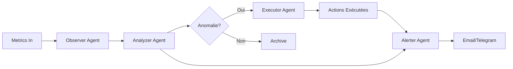

# 🚀 VPS Monitoring AI - Système de Surveillance Agentic

> **POC d'un système de monitoring intelligent multi-rôles orchestré avec CrewAI pour la surveillance, détection d'anomalies, actions automatiques et alerting sur infrastructure VPS Master-Slave**

[](https://python.org)
[](https://www.crewai.com/)
[](https://fastapi.tiangolo.com/)
[](https://reactjs.org/)
[](LICENSE)

---

## 📋 Table des Matières

- [Vue d'ensemble](#-vue-densemble)
- [Architecture](#-architecture)
- [Fonctionnalités](#-fonctionnalités)
- [Stack Technique](#-stack-technique)
- [Prérequis](#-prérequis)
- [Installation](#-installation)
- [Configuration](#-configuration)
- [Utilisation](#-utilisation)
- [Agents CrewAI](#-agents-crewai)
- [Machine Learning](#-machine-learning)
- [API Documentation](#-api-documentation)
- [Compliance & Audit](#-compliance--audit)
- [Troubleshooting](#-troubleshooting)
- [Roadmap](#-roadmap)

---

## 🎯 Vue d'ensemble

### Problématique

La surveillance manuelle de 10-20 VPS avec 20-100 containers chacun est chronophage et sujette à erreurs. Les incidents critiques peuvent passer inaperçus pendant les heures non ouvrées.

### Solution

Un système **Agentic AI** avec 4 agents spécialisés qui :

1. **Observe** les métriques en temps réel (CPU/Mémoire/Disque/Containers)
2. **Analyse** les anomalies avec ML (Isolation Forest + LSTM)
3. **Exécute** des actions automatiques (restart, cleanup, cache clear)
4. **Alerte** via Email et Telegram avec intelligence anti-spam

### Bénéfices

- 🚨 **Détection précoce** : Anomalies détectées avant impact critique
- 🤖 **Auto-remédiation** : 80% des incidents résolus automatiquement
- 📊 **Visibilité totale** : Dashboard temps réel inspiré de Grafana
- 🛡️ **Compliance** : Audit trails pour ISO 27001
- 💰 **ROI** : Réduction de 70% du temps d'intervention manuel

---

## 🏗️ Architecture

### Architecture Globale

```
┌─────────────────────────────────────────────────────────────┐
│                      MASTER NODE                             │
│  ┌─────────────────────────────────────────────────────┐   │
│  │  FastAPI Backend + CrewAI Orchestrator              │   │
│  │  ┌──────────┐  ┌──────────┐  ┌──────────┐          │   │
│  │  │ Observer │→│ Analyzer │→│ Executor │→ Alerter   │   │
│  │  │  Agent   │  │  Agent   │  │  Agent   │          │   │
│  │  └──────────┘  └──────────┘  └──────────┘          │   │
│  │         ↓             ↓                               │   │
│  │    ┌─────────────────────────┐                       │   │
│  │    │ ML Anomaly Detector     │                       │   │
│  │    │ • Isolation Forest      │                       │   │
│  │    │ • LSTM Time-Series      │                       │   │
│  │    └─────────────────────────┘                       │   │
│  └─────────────────────────────────────────────────────┘   │
│                                                              │
│  ┌──────────────┐  ┌──────────────┐  ┌──────────────┐     │
│  │   MySQL      │  │  InfluxDB    │  │   Redis      │     │
│  │  (Metadata)  │  │ (Time-Series)│  │  (Cache)     │     │
│  └──────────────┘  └──────────────┘  └──────────────┘     │
│                                                              │
│  ┌─────────────────────────────────────────────────────┐   │
│  │          React UI (Dashboard + Management)          │   │
│  └─────────────────────────────────────────────────────┘   │
└──────────────────────┬───────────────────────────────────┘
                       │ gRPC + WebSocket
        ┌──────────────┼──────────────┐
        │              │               │
┌───────▼──────┐ ┌────▼───────┐ ┌────▼───────┐
│ SLAVE NODE 1 │ │SLAVE NODE 2│ │SLAVE NODE N│
│              │ │            │ │            │
│ ┌──────────┐ │ │┌──────────┐│ │┌──────────┐│
│ │Collector │ │ ││Collector ││ ││Collector ││
│ │ Agent    │ │ ││  Agent   ││ ││  Agent   ││
│ └────┬─────┘ │ │└────┬─────┘│ │└────┬─────┘│
│      │       │ │     │      │ │     │      │
│  Docker Stats│ │ Docker Stats│ │Docker Stats│
│   20-100     │ │   Containers│ │ Containers │
│  Containers  │ │             │ │            │
└──────────────┘ └─────────────┘ └────────────┘
```

### Workflow des Agents



### Communication Master-Slave

- **gRPC** : Envoi métriques (efficace, binaire)
- **WebSocket** : UI temps réel (updates instantanés)
- **Heartbeat** : Détection nœuds offline (30s interval)

---

## ✨ Fonctionnalités

### 🔍 Monitoring Temps Réel

- ✅ Collecte métriques système (CPU/RAM/Disk) toutes les **5 secondes**
- ✅ Monitoring Docker containers (stats, status, logs)
- ✅ Détection nœuds offline en **< 1 minute**
- ✅ Historique 7 jours avec agrégation intelligente

### 🤖 Intelligence Artificielle

#### 4 Agents Spécialisés CrewAI

1. **Observer Agent** : Expert système avec 15 ans d'expérience
   - Observe métriques en temps réel
   - Analyse tendances historiques
   - Évalue santé globale du système

2. **Analyzer Agent** : Data Scientist DevOps senior
   - Détection d'anomalies (ML + règles)
   - Analyse causes racines
   - Corrélation multi-nœuds

3. **Executor Agent** : SRE avec 20 ans d'expérience
   - Planification actions sécurisées
   - Dry-run avant exécution
   - Rollback automatique si échec

4. **Alerter Agent** : Incident Commander
   - Décision intelligente d'alerting
   - Anti-spam et déduplication
   - Messages clairs et actionnables

#### ML Hybride

- **Isolation Forest** : Détection outliers (anomalies non supervisées)
- **LSTM** : Prédiction temps réel (patterns temporels)
- **Entraînement centralisé** sur master (tous les nœuds contribuent)
- **Réentraînement automatique** toutes les 24h

### ⚡ Actions Automatiques

| Action | Déclencheur | Safety |
|--------|-------------|---------|
| **Restart Container** | Crash loop, Memory leak | Budget: 10/heure |
| **Clear Cache** | Memory > 90% | Dry-run first |
| **Disk Cleanup** | Disk > 95% | Garde 20% libre |
| **Stop Container** | CPU spike anormal | Notification immédiate |

**Règles de Sécurité** :
- ⚠️ Maximum 10 actions/heure (configurable)
- ⚠️ Mode simulation (dry-run) disponible
- ⚠️ Logs audit pour chaque action
- ⚠️ Rollback automatique si échec

### 📊 Dashboard UI

Interface inspirée de Grafana avec :

#### Onglet Principal : Vue d'ensemble
- 📈 Graphiques temps réel (Recharts)
- 🎨 Couleurs dynamiques selon seuils
- 📊 CPU/Memory/Disk par nœud
- 🔔 Journal des actions exécutées

#### Onglet Containers
- 📦 Liste tous les containers du nœud
- ⚙️ Détails : Nom, Port, Image, État
- 📊 Consommation CPU/RAM/Disk
- 🔗 Lien logs en temps réel
- ▶️ Boutons Start/Stop avec RBAC

#### Fonctionnalités Avancées
- 🔍 Filtrage et recherche
- 📥 Export données (CSV, JSON)
- 🌙 Mode sombre/clair
- 📱 Responsive (mobile-friendly)

### 🔐 Sécurité & RBAC

| Rôle | Permissions |
|------|-------------|
| **Admin** | Tout accès + gestion utilisateurs |
| **Operator** | Actions manuelles + configuration |
| **Viewer** | Lecture seule (dashboards) |

- 🔒 Authentification JWT
- 🛡️ Audit trail complet (IP, User-Agent, Actions)
- 📝 Logs conformes ISO 27001
- 🔑 Rotation automatique tokens

### 📧 Alerting Intelligent

#### Canaux
- ✉️ **Email** : Formatage HTML professionnel
- 📱 **Telegram** : Messages avec emojis (🔴 Critical, ⚠️ Warning)

#### Intelligence
- 🧠 Déduplication (pas d'alerte si < 1h)
- 📊 Contexte complet (métriques, actions prises)
- ✅ Notifications de résolution automatiques
- 📈 Résumés quotidiens (optionnel)

---

## 🛠️ Stack Technique

### Backend (Python)

| Composant | Technologie | Rôle |
|-----------|-------------|------|
| Framework | **FastAPI** | API REST + WebSocket |
| AI Agents | **CrewAI 0.28** | Orchestration multi-agents |
| LLM | **OpenAI GPT-4** | Intelligence des agents |
| gRPC | **grpcio** | Communication Master-Slave |
| ML | **Scikit-learn, TensorFlow** | Anomaly Detection |
| DB SQL | **MySQL + SQLAlchemy** | Metadata, Users, Audit |
| DB Time-Series | **InfluxDB** | Métriques haute fréquence |
| Cache | **Redis** | Sessions, rate limiting |
| Queue | **RabbitMQ** | Actions asynchrones |

### Frontend (React)

| Composant | Technologie | Rôle |
|-----------|-------------|------|
| Framework | **React 18 + TypeScript** | UI moderne |
| Charts | **Recharts** | Graphiques temps réel |
| Styling | **Tailwind CSS** | Design system |
| State | **React Query** | Data fetching |
| Auth | **JWT + Context API** | Authentification |
| WebSocket | **Socket.io-client** | Temps réel |

### DevOps

- **Docker** : Conteneurisation (multi-stage builds)
- **Docker Compose** : Orchestration locale
- **Nginx** : Reverse proxy + SSL
- **Prometheus** : Métriques optionnelles (compatibility)

---

## 📦 Prérequis

### Nœud Master

```bash
- Python 3.9+ (3.10 recommandé)
- Node.js 18+ (frontend)
- MySQL 8.0+
- InfluxDB 2.x
- Redis 7.x
- RabbitMQ 3.12+
- Docker 24+ (pour conteneurisation)
- 4 CPU, 8 GB RAM minimum
```

### Nœuds Slaves

```bash
- Python 3.9+
- Docker 24+ (pour monitoring containers)
- 2 CPU, 2 GB RAM minimum
- Accès réseau au master (gRPC port 50051)
```

### Compte OpenAI

- Clé API OpenAI (GPT-4 recommandé)
- Budget suggéré : ~$50/mois pour 10-20 nœuds

---

## 🚀 Installation

### 1. Cloner le Repository

```bash
git clone <repo-url>
cd vps-monitoring-ai
```

### 2. Configuration Master Node

#### A. Installer les dépendances Python

```bash
# Créer environnement virtuel
python -m venv venv
source venv/bin/activate  # Windows: venv\Scripts\activate

# Installer dépendances
pip install -r requirements.txt
```

#### B. Configurer les variables d'environnement

```bash
# Copier le template
cp .env.example .env

# Éditer avec vos valeurs
nano .env
```

**Configuration minimum requise** :

```env
# LLM
OPENAI_API_KEY=sk-your-key-here
OPENAI_MODEL=gpt-4-turbo-preview

# MySQL
MYSQL_HOST=localhost
MYSQL_USER=monitoring_user
MYSQL_PASSWORD=SecurePassword123!
MYSQL_DATABASE=vps_monitoring

# InfluxDB
INFLUX_URL=http://localhost:8086
INFLUX_TOKEN=your-token-here
INFLUX_ORG=vps-monitoring
INFLUX_BUCKET=metrics

# Alerting
SMTP_USER=your-email@gmail.com
SMTP_PASSWORD=your-app-password
TELEGRAM_BOT_TOKEN=your-bot-token
TELEGRAM_CHAT_ID=your-chat-id

# Security
JWT_SECRET_KEY=generate-a-random-32-char-key
```

#### C. Générer protobuf gRPC

```bash
cd shared/proto
python -m grpc_tools.protoc -I. --python_out=../../backend/grpc_gen --grpc_python_out=../../backend/grpc_gen monitoring.proto
```

#### D. Initialiser les bases de données

```bash
# MySQL
mysql -u root -p
CREATE DATABASE vps_monitoring CHARACTER SET utf8mb4 COLLATE utf8mb4_unicode_ci;
CREATE USER 'monitoring_user'@'localhost' IDENTIFIED BY 'SecurePassword123!';
GRANT ALL PRIVILEGES ON vps_monitoring.* TO 'monitoring_user'@'localhost';
FLUSH PRIVILEGES;
exit;

# InfluxDB (via UI ou CLI)
influx setup \
  --username admin \
  --password SecurePassword123! \
  --org vps-monitoring \
  --bucket metrics \
  --force
```

#### E. Initialiser les tables

```bash
python -c "from backend.database.connection import init_database; init_database()"
```

#### F. Créer un utilisateur admin

```bash
python scripts/create_admin_user.py \
  --username admin \
  --email admin@example.com \
  --password YourSecurePassword
```

### 3. Configuration Frontend

```bash
cd frontend
npm install

# Créer .env.local
echo "REACT_APP_API_URL=http://localhost:8000" > .env.local
echo "REACT_APP_WS_URL=ws://localhost:8001" >> .env.local
```

### 4. Démarrer le Master

#### Option A : Développement (mode debug)

```bash
# Terminal 1 : Backend
cd backend
uvicorn main:app --reload --host 0.0.0.0 --port 8000

# Terminal 2 : Frontend
cd frontend
npm start
```

#### Option B : Production (Docker Compose)

```bash
docker-compose up -d
```

**Vérifier les services** :

```bash
docker-compose ps
# Tous les services doivent être "Up"
```

### 5. Configuration Slave Nodes

Sur chaque nœud slave :

```bash
# Copier le script collector
scp slave/collector.py user@slave-node:/opt/monitoring/

# Installer dépendances
ssh user@slave-node
pip install grpcio docker psutil

# Configurer
export MASTER_HOST=<master-ip>
export MASTER_PORT=50051
export NODE_NAME=slave-node-1

# Lancer (systemd recommandé)
python /opt/monitoring/collector.py
```

#### Systemd Service (optionnel mais recommandé)

```bash
# Créer /etc/systemd/system/monitoring-collector.service
[Unit]
Description=VPS Monitoring Collector
After=network.target docker.service

[Service]
Type=simple
User=monitoring
Environment="MASTER_HOST=192.168.1.100"
Environment="MASTER_PORT=50051"
Environment="NODE_NAME=slave-01"
ExecStart=/usr/bin/python3 /opt/monitoring/collector.py
Restart=always
RestartSec=10

[Install]
WantedBy=multi-user.target
```

```bash
sudo systemctl daemon-reload
sudo systemctl enable monitoring-collector
sudo systemctl start monitoring-collector
```

---

## ⚙️ Configuration

### Seuils d'Alerte

Éditer `.env` :

```env
# Warning thresholds
CPU_WARNING_THRESHOLD=70
MEMORY_WARNING_THRESHOLD=75
DISK_WARNING_THRESHOLD=80

# Critical thresholds
CPU_CRITICAL_THRESHOLD=85
MEMORY_CRITICAL_THRESHOLD=90
DISK_CRITICAL_THRESHOLD=95
```

### Actions Automatiques

```env
# Budget de sécurité
MAX_ACTIONS_PER_HOUR=10

# Enable/Disable actions
ENABLE_AUTO_RESTART=true
ENABLE_CACHE_CLEAR=true
ENABLE_DISK_CLEANUP=true
```

### ML Model

```env
# Seuil détection anomalie (0-1)
ANOMALY_THRESHOLD=0.7

# Réentraînement automatique
RETRAIN_INTERVAL_HOURS=24
MIN_TRAINING_SAMPLES=1000
```

---

## 📖 Utilisation

### Accéder au Dashboard

```
http://master-ip:3000
```

**Login** : Utilisez les credentials créés à l'installation

### Ajouter un Nœud

1. UI → **Nodes** → **Add Node**
2. Remplir :
   - Name: `prod-web-01`
   - IP: `192.168.1.50`
   - Type: `slave`
3. Copier la commande d'installation générée
4. Exécuter sur le nœud slave

### Surveiller un Container

Les containers sont automatiquement détectés. Pour activer le monitoring :

1. **Containers** → Sélectionner container
2. **Enable Monitoring**
3. Configurer seuils personnalisés (optionnel)

### Consulter les Logs

```bash
# Logs backend
docker logs -f vps-monitoring-backend

# Logs agents CrewAI
tail -f logs/agents.log

# Logs actions
tail -f logs/actions.log
```

### Forcer un Réentraînement ML

```bash
curl -X POST http://localhost:8000/api/ml/retrain \
  -H "Authorization: Bearer YOUR_JWT_TOKEN"
```

---

## 🤖 Agents CrewAI

### Observer Agent

**Rôle** : Administrateur système expert

**Tâches** :
- `create_observation_task()` : Analyse état actuel
- `create_trend_analysis_task()` : Analyse tendances historiques

**Sorties** :
- Overall Health: HEALTHY/WARNING/CRITICAL
- Key Findings
- Resource Concerns
- Container Issues

### Analyzer Agent

**Rôle** : DevOps + Data Scientist

**Tâches** :
- `create_anomaly_detection_task()` : Détection anomalies (ML + règles)
- `create_correlation_task()` : Corrélation multi-nœuds
- `create_explanation_task()` : Explication post-action

**Sorties** :
- Anomaly Classification
- Root Cause Analysis
- Risk Assessment
- Recommended Actions

### Executor Agent

**Rôle** : Site Reliability Engineer (SRE)

**Tâches** :
- `create_action_planning_task()` : Planification actions
- `create_execution_validation_task()` : Validation dry-run
- `create_post_action_analysis_task()` : Analyse post-exécution

**Sorties** :
- Action Plan (priorité, séquence, risques)
- GO/NO-GO Decision
- Success Assessment

### Alerter Agent

**Rôle** : Incident Commander

**Tâches** :
- `create_alert_decision_task()` : Décision d'alerting
- `create_message_formatting_task()` : Formatage messages
- `create_alert_resolution_task()` : Notification résolution

**Sorties** :
- SEND_CRITICAL / SEND_WARNING / DO_NOT_SEND
- Messages formatés (Email + Telegram)

---

## 🧠 Machine Learning

### Modèles Utilisés

#### 1. Isolation Forest

- **Type** : Unsupervised Outlier Detection
- **Usage** : Détection anomalies sur métriques individuelles
- **Entraînement** : 1000+ samples requis
- **Contamination** : 10% (ajustable)

**Métriques surveillées** :
- `cpu_percent`
- `memory_percent`
- `disk_percent`
- `memory_used_mb`
- `disk_used_gb`

#### 2. LSTM (Long Short-Term Memory)

- **Type** : Time-Series Prediction
- **Usage** : Prédiction valeurs futures + détection patterns anormaux
- **Séquence** : 60 data points (5 min à 5s d'intervalle)
- **Architecture** :
  - LSTM(64) → Dropout(0.2)
  - LSTM(32) → Dropout(0.2)
  - Dense(16) → Dense(3)

**Anomalie LSTM** : Si erreur de prédiction > 15%

### Entraînement

```python
# Automatique (schedulé)
# Tous les jours à 2h du matin

# Manuel (API)
POST /api/ml/train
{
  "model_type": "both",  # isolation_forest, lstm, both
  "node_ids": [1, 2, 3],  # null = tous
  "lookback_days": 7
}
```

### Scores Combinés

```python
# Score final = moyenne(IF_score, LSTM_score)
# Anomalie si score > ANOMALY_THRESHOLD (0.7 par défaut)

anomaly_score = (if_normalized + lstm_normalized) / 2
is_anomaly = anomaly_score > settings.anomaly_threshold
```

---

## 📡 API Documentation

### Base URL

```
http://master-ip:8000/api/v1
```

### Authentification

```bash
# Login
POST /auth/login
{
  "username": "admin",
  "password": "password"
}

# Response
{
  "access_token": "eyJ...",
  "token_type": "bearer"
}

# Utilisation
curl -H "Authorization: Bearer eyJ..." http://localhost:8000/api/v1/nodes
```

### Endpoints Principaux

#### Nodes

```bash
# Lister nœuds
GET /nodes

# Détails nœud
GET /nodes/{node_id}

# Métriques nœud (dernières)
GET /nodes/{node_id}/metrics?limit=100

# Ajouter nœud
POST /nodes
{
  "name": "web-server-01",
  "ip_address": "192.168.1.50",
  "node_type": "slave"
}
```

#### Containers

```bash
# Lister containers d'un nœud
GET /nodes/{node_id}/containers

# Détails container
GET /containers/{container_id}

# Logs container (streaming)
GET /containers/{container_id}/logs?tail=100&follow=true

# Actions
POST /containers/{container_id}/start
POST /containers/{container_id}/stop
POST /containers/{container_id}/restart
```

#### Actions

```bash
# Historique actions
GET /actions?node_id=1&limit=50

# Détails action
GET /actions/{action_id}

# Exécuter action manuelle
POST /actions/execute
{
  "node_id": 1,
  "container_id": 5,
  "action_type": "RESTART_CONTAINER",
  "reason": "High memory usage",
  "dry_run": false
}
```

#### Alerts

```bash
# Alertes actives
GET /alerts?is_resolved=false

# Résoudre alerte
PUT /alerts/{alert_id}/resolve
```

#### ML

```bash
# Entraîner modèle
POST /ml/train

# Prédiction manuelle
POST /ml/predict
{
  "node_id": 1,
  "current_metrics": {...},
  "historical_sequence": [...]
}

# Statut modèles
GET /ml/models
```

### WebSocket

```javascript
// Connexion
const ws = new WebSocket('ws://master-ip:8001/ws');

// Subscribe à un nœud
ws.send(JSON.stringify({
  type: 'subscribe',
  node_id: 1
}));

// Recevoir métriques temps réel
ws.onmessage = (event) => {
  const data = JSON.parse(event.data);
  // data.cpu_percent, data.memory_percent, ...
};
```

---

## 🛡️ Compliance & Audit

### ISO 27001

Le système est conçu pour la conformité ISO 27001 :

✅ **A.12.4 Logging and Monitoring**
- Tous les événements système loggés
- Audit trail immutable (timestamps, user, IP, action)

✅ **A.9.2 User Access Management**
- RBAC avec 3 rôles
- Principe du moindre privilège

✅ **A.12.6 Technical Vulnerability Management**
- Détection anomalies ML
- Alerting automatique

### Rapports Compliance

```bash
# Générer rapport audit (7 derniers jours)
curl -X GET http://localhost:8000/api/reports/audit \
  -H "Authorization: Bearer $TOKEN" \
  --output audit_report.pdf
```

### Rétention Données

| Type | Durée | Purge |
|------|-------|-------|
| Métriques temps réel | 7 jours | Auto |
| Logs applicatifs | 7 jours | Auto |
| Audit logs | 90 jours | Manuel |
| Actions historiques | 30 jours | Auto |

---

## 🔧 Troubleshooting

### Slave n'envoie pas de métriques

```bash
# Vérifier connectivité gRPC
telnet master-ip 50051

# Vérifier logs slave
python collector.py --debug

# Tester envoi manuel
python -c "from collector import test_connection; test_connection()"
```

### Agents CrewAI lents

```bash
# Vérifier quota OpenAI
curl https://api.openai.com/v1/usage \
  -H "Authorization: Bearer $OPENAI_API_KEY"

# Utiliser modèle plus rapide
OPENAI_MODEL=gpt-3.5-turbo  # Dans .env
```

### ML model non chargé

```bash
# Vérifier fichiers modèles
ls -lh ml_models/

# Réentraîner
curl -X POST http://localhost:8000/api/ml/train
```

### Alertes non reçues

```bash
# Tester Email
python scripts/test_email.py --to your@email.com

# Tester Telegram
python scripts/test_telegram.py --message "Test"

# Vérifier logs alerting
tail -f logs/alerts.log
```

---

## 🗺️ Roadmap

### v1.1 (Q2 2025)

- [ ] Support Kubernetes (en plus de Docker)
- [ ] Mobile app (React Native)
- [ ] Intégration Slack
- [ ] Dashboards personnalisables

### v1.2 (Q3 2025)

- [ ] Prédiction proactive (24h à l'avance)
- [ ] Auto-scaling recommandations
- [ ] Corrélation logs + métriques
- [ ] Support multi-cloud (AWS, Azure, GCP)

### v2.0 (Q4 2025)

- [ ] Modèles ML spécialisés par type d'app
- [ ] Playbooks automatiques avancés
- [ ] Intégration PagerDuty / Opsgenie
- [ ] Mode SaaS multi-tenant

---

## 👨‍💻 Contribution

Les contributions sont les bienvenues ! Veuillez :

1. Fork le projet
2. Créer une branche (`git checkout -b feature/AmazingFeature`)
3. Commit (`git commit -m 'Add AmazingFeature'`)
4. Push (`git push origin feature/AmazingFeature`)
5. Ouvrir une Pull Request

---

## 📄 License

MIT License - voir [LICENSE](LICENSE)

---

## 🙏 Remerciements

- **CrewAI** : Framework multi-agents exceptionnel
- **FastAPI** : Performance et simplicité
- **OpenAI** : GPT-4 pour l'intelligence des agents
- **Grafana** : Inspiration pour le design UI

---

## 📧 Support

- 📧 Email : support@vps-monitoring.local
- 💬 Discord : [Lien Discord]
- 📖 Documentation : [docs.vps-monitoring.local]
- 🐛 Issues : [GitHub Issues]

---

**Développé avec ❤️ pour simplifier la vie des DevOps**
